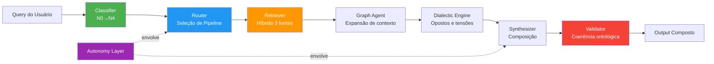

# MestreCuca — Sistema Cognitivo Ontológico

> **Status:** `[READY FOR DEVELOPMENT]` · **Versão:** 3.0.0 · **Base Ontológica:** 162 células N4 (2×3×3×3×3)

Sistema cognitivo baseado em ontologia fractal que transforma uma estrutura estática de conhecimento em um motor de inferência, recuperação híbrida e síntese composta. O pipeline opera sobre 6 pilares ontológicos, 18 domínios, 54 subárvores e 162 células operacionais.

---

## Arquitetura Macro



**Três modos de pipeline:**

| Pipeline | Etapas | Uso |
|---|---|---|
| **Full** | Classifier → Router → Retriever → Graph → Dialectic → Synthesizer → Validator | Queries complexas, máxima profundidade |
| **Simple** | Router → Retriever → Synthesizer → Validator | Queries rápidas, baixa complexidade |
| **Autonomous** | Full + Autonomy Layer | Auto-avaliação, feedback loop, thresholds adaptativos |

---

## Stack Tecnológico

| Componente | Valor |
|---|---|
| Runtime | Python 3.13 |
| Grafos | NetworkX ≥3.0 (MultiDiGraph) |
| Embeddings | `all-MiniLM-L6-v2` (384d, FAISS IVFFlat, cosine) |
| LLM (Agents) | GPT-4o / GPT-4o-mini |
| Indexação Vetorial | FAISS IVF (nlist=100, nprobe=10) |
| Reranking | Cross-encoder (`ms-marco-MiniLM-L-6-v2`) |
| Serialização | JSON, Parquet, GEXF |
| Memória | SQLite (longo prazo), LRU cache (curto prazo) |

**Dependências** ([`requirements.txt`](./requirements.txt)):

```
numpy>=1.24
networkx>=3.0
sentence-transformers>=2.2
pyyaml>=6.0
scikit-learn>=1.2
rich>=13.0
tqdm>=4.65
```

---

## Estrutura de Diretórios

```
MestreCuca/
│
├── run_kilo.py                    # Entrypoint principal (CLI)
├── run_diag.py                    # Diagnóstico de rede ontológica
├── run_diag.bat                   # Wrapper batch para diagnóstico
├── run_test.bat                   # Teste completo + exportação de grafos
├── diag.py                        # Diagnóstico de dados JSON
├── diag_env.py                    # Diagnóstico de ambiente/dependências
├── diag_data.py                   # Diagnóstico de dados
├── requirements.txt               # Dependências Python
│
├── core/                          # Motores centrais (framework agnóstico)
│   ├── __init__.py                # v3.0.0 — OntoClassifier, OntoRetriever, ...
│   ├── agent_base.py              # BaseAgent, AgentResult, AgentMemory
│   ├── ontology_graph.py          # OntologyGraph (NetworkX)
│   ├── signature_engine.py        # Assinaturas semânticas 9D
│   ├── dialectic_engine.py        # Inferência de opostos (5 níveis)
│   ├── cognitive_function_engine.py
│   ├── ontology_typing.py         # 10 naturezas ontológicas
│   └── relation_engine.py         # 10 tipos de relação ponderados
│
├── runtime/                       # Módulos de execução do pipeline
│   ├── __init__.py                # v3.0.0 — HybridRetriever
│   ├── classifier.py              # OntologicalClassifier
│   ├── router.py                  # CognitiveRouter
│   ├── retriever.py               # HybridRetriever
│   ├── synthesizer.py             # OntologySynthesizer
│   ├── validator.py               # OntologyValidator
│   └── orchestrator.py            # MultiAgentOrchestrator
│
├── .kilo/                         # Configuração interna do sistema
│   ├── agents/
│   │   ├── agents.yaml            # 6 agentes configurados
│   │   ├── autonomy_layer.py      # Auto-avaliação (~550 linhas)
│   │   ├── classifier_agent.py
│   │   ├── graph_agent.py
│   │   ├── synthesis_agent.py
│   │   ├── validator_agent.py
│   │   ├── dialectic_agent.py
│   │   ├── driver.py              # ⚠️ Issues de path no Windows
│   │   ├── health_check.py        # 13 verificações
│   │   └── multi_agent_orchestrator.py
│   ├── memory/
│   │   └── memory.yaml            # 5 níveis: volatile, trabalho, longo_prazo, cache
│   ├── orchestrators/
│   │   └── orchestrators.yaml     # 3 pipelines: principal, basico, precisao
│   └── prompts/
│       ├── classifier/
│       ├── retrieval/
│       ├── routing/
│       ├── synthesis/
│       └── validation/
│
├── config/                        # Configuração operacional
│   ├── ontology.yaml              # Definição fractal N0→N4 (162 células)
│   ├── embedding.yaml             # Modelo, FAISS, cache
│   ├── graph.yaml                 # NetworkX: nós, arestas, algoritmos
│   └── retrieval.yaml             # Híbrido: limiares, reranking, cache
│
├── data/                          # Dados gerados e processados
│   ├── json/                      # 162 N4 JSONs + ontology_index.json
│   ├── embeddings/                # 162 vetores .npy (384-dim)
│   ├── graphs/                    # Exportações GEXF/JSON + métricas
│   ├── indexes/                   # Índices de busca auxiliares
│   └── semantic_expansion_report.md
│
├── scripts/                       # Scripts de build/geração
│   ├── create_fase0.py            # Gerador principal de artefatos
│   ├── create_n3_files.py / v2
│   ├── create_n4_files.py
│   ├── create_n4_from_taxonomy.py
│   ├── validate_yaml.py
│   └── _*.py                      # Auxiliares de diagnóstico
│
├── docs/                          # Documentação
│   ├── arquitetura_sistema_cognitivo.md
│   ├── USAGE.md
│   └── roadmap/
│       ├── 1 - Semantic Operating Substrate - roadmap.md
│       ├── 1.1 - Roadmap-ImpN5.yaml
│       ├── 2 - COGNITIVE_EXPRESSION_LAYER_ROADMAP.md
│       └── 3 - Semantic Cognitive Infrastructure Stack.md
│
├── ontology/                      # Fontes ontológicos
├── prompts/                       # Templates YAML
├── tests/                         # Testes automatizados (pytest)
└── tools/                         # Utilitários (vazio)
```

---

## Conceitos Fundamentais

### Ontologia Fractal — N0 → N4

```
N0 (Vetor)           2 nós         SINTRÓPICO | ENTRÓPICO
  │
  ├── N1 (Pilar)     6 nós        LOGOS | BIOS | PATHOS | KHAOS | APEIRON | MYTHOS
    │
    ├── N2 (Domínio) 18 nós       ALGORITMIA | NOMOS | MECÂNICA | OIKOS | SOMA | ...
      │
      ├── N3 (Subárvore) 54 nós   RESOLUÇÃO | OTIMIZAÇÃO | VALIDAÇÃO | ...
        │
        └── N4 (Célula) 162 nós   DECOMPOSIÇÃO | SEQUÊNCIA | CASO_BASE | ...
```

**Cardinalidade:** `2 × 3 × 3 × 3 × 3 = 162` células N4

### Pilares Ontológicos

| Pilar | Domínios | Natureza | Vetor Default |
|---|---|---|---|
| **LOGOS** | ALGORITMIA, NOMOS, MECÂNICA | Processo | SINTRÓPICO |
| **BIOS** | OIKOS, SOMA, METABOLISMO | Organismo | SINTRÓPICO |
| **PATHOS** | ETHOS, ALTERIDADE, ESTÉTICA | Relação | SINTRÓPICO |
| **KHAOS** | ENTROPIA, SINGULARIDADE, SÍNTESE | Transformação | ENTRÓPICO |
| **APEIRON** | PROPORÇÃO, VIBRATIO, VÁCUO | Escala | ENTRÓPICO |
| **MYTHOS** | ARQUÉTIPO, NARRATIVA, MISTÉRI | Símbolo | ENTRÓPICO |

### Tipos de Relação (Grafo)

| Tipo | Semântica | Peso |
|---|---|---|
| `depende_de` | Pré-requisito | 0.8–1.0 |
| `complementa` | Completude | 0.6–0.9 |
| `contrasta` | Oposição | −0.5 a −0.9 |
| `expande` | Generalização | 0.5–0.8 |
| `implementa` | Concretização | 0.7–0.9 |
| `causa` | Causalidade | 0.7–0.95 |
| `equilibra` | Homeostase | 0.5–0.8 |
| `transforma` | Metamorfose | 0.6–0.9 |

---

## Operação

> **Nota:** Este projeto não possui `Makefile`. Todos os entrypoints são scripts Python executados diretamente.

### Entrypoint Principal

```powershell
# Health check (13 verificações de integridade)
python run_kilo.py --health

# Query única — pipeline completo
python run_kilo.py --query "como decompor este problema?"

# Query com modo simplificado
python run_kilo.py --mode simple --query "o que é otimização?"

# Pipeline autônomo (auto-avaliação + feedback loop)
python run_kilo.py --mode autonomous --query "como otimizar processos?"

# Modo interativo (REPL)
python run_kilo.py --mode interactive

# Logging detalhado
python run_kilo.py --query "teste" --verbose --log-level DEBUG
```

**Modos disponíveis:** `full` (padrão) · `simple` · `autonomous` · `interactive`

### Diagnóstico

```powershell
# Diagnóstico da rede ontológica (grafo, nós, arestas, métricas)
python run_diag.py

# Diagnóstico de ambiente (dependências, imports, índices)
python diag_env.py

# Diagnóstico de dados (JSONs, embeddings, índices)
python diag_data.py
```

### Testes & Build

```powershell
# Teste completo + exportação de grafos (batch)
run_test.bat

# Diagnóstico via batch
run_diag.bat

# Testes pytest
python -m pytest tests/ -v
```

### Scripts de Geração

| Script | Função |
|---|---|
| `scripts/create_fase0.py` | Geração massiva de artefatos ontológicos |
| `scripts/create_n3_files.py` | Geração de arquivos N3 (subárvores) |
| `scripts/create_n4_files.py` | Geração de arquivos N4 (células) |
| `scripts/create_n4_from_taxonomy.py` | Geração N4 a partir de taxonomia |
| `scripts/validate_yaml.py` | Validação de arquivos YAML |

---

## Configuração

### Arquivos de Configuração

| Arquivo | Propósito |
|---|---|
| `config/ontology.yaml` | Definição completa da ontologia fractal (N0→N4) |
| `config/embedding.yaml` | Modelo de embedding, FAISS, cache |
| `config/graph.yaml` | Configuração do grafo NetworkX, algoritmos, visualização |
| `config/retrieval.yaml` | Retrieval híbrido: limiares, fusão, reranking |
| `.kilo/agents/agents.yaml` | 6 agentes LLM (GPT-4o / GPT-4o-mini) |
| `.kilo/orchestrators/orchestrators.yaml` | 3 pipelines: principal, básico, alta precisão |
| `.kilo/memory/memory.yaml` | 5 níveis de memória (volatile → persistente) |

### Variáveis de Ambiente

Todas as configurações sensíveis (chaves de API, senhas) devem ser carregadas via `.env`:

```powershell
# Exemplo — nunca commit .env
API_KEY="sua_chave_aqui"
SECRET_KEY="seu_segredo_aqui"
```

> ⚠️ `.env` deve estar em `.gitignore`. Nunca commit dados sensíveis.

---

## Desenvolvimento & Testes

### Ambiente de Desenvolvimento

```powershell
# Criar ambiente virtual
python -m venv .venv

# Ativar
.\.venv\Scripts\Activate.ps1

# Instalar dependências
pip install -r requirements.txt
```

### Testes

```powershell
# Todos os testes
python -m pytest tests/ -v

# Teste específico
python -m pytest tests/test_classifier.py -v
```

### Estrutura de Testes

```
tests/
├── conftest.py                    # Fixtures compartilhadas
├── test_classifier.py             # Testes do classificador (36.8 KB)
├── run_diag.py                    # Diagnóstico integrado
└── ONTO_ENGINE_ROADMAP-DEEP.md    # Especificação do motor ontológico
```

---

## Memória Técnica

O `.kilo/STATE.md` é a fonte de contexto persistente para agentes de IA que operam sobre o projeto. Contém:

- Estado atual do sistema (versão, fase, componentes ativos)
- Decisões de arquitetura recentes
- Bugs conhecidos e workarounds
- Histórico de migrações e mudanças de schema

**Referência:** [`.kilo/STATE.md`](./.kilo/STATE.md) · [`.kilo/memory/memory.yaml`](./.kilo/memory/memory.yaml)

---

## Documentação & Roadmap

### Documentação

| Documento | Descrição |
|---|---|
| [`docs/arquitetura_sistema_cognitivo.md`](./docs/arquitetura_sistema_cognitivo.md) | Arquitetura completa (728 linhas) |
| [`docs/USAGE.md`](./docs/USAGE.md) | Guia de uso, API programática, exemplos |
| [`docs/roadmap/`](./docs/roadmap/) | 3 roadmaps detalhados (YAML/MD) |

### Roadmap Principal

O roadmap está em [`docs/roadmap/`](./docs/roadmap/) e define 4 pilares de evolução:

| Pilar | Objetivo | Status |
|---|---|---|
| **I — Ocultação da Complexidade** | Interface em linguagem natural | Fase 0 |
| **II — Automação do Roteamento** | Pipeline programático, RAG vetorial | Pendente |
| **III — UX Operacional** | Modos assistidos, calibrador de tolerância | Pendente |
| **IV — Integração Total** | Compilador cognitivo estrito, blindagem | Pendente |

**Avaliação atual:** 7.5/10 · **Pós-roadmap:** 10/10

### Roadmaps Detalhados

- [`docs/roadmap/1 - Semantic Operating Substrate`](./docs/roadmap/1%20-%20Semantic%20Operating%20Substrate%20-%20roadmap.md) — Expansão N5, anti-colisão semântica
- [`docs/roadmap/2 - COGNITIVE_EXPRESSION_LAYER`](./docs/roadmap/2%20-%20COGNITIVE_EXPRESSION_LAYER_ROADMAP.md) — Camada meta-cognitiva adaptativa
- [`docs/roadmap/3 - Semantic Cognitive Infrastructure Stack`](./docs/roadmap/3%20-%20Semantic%20Cognitive%20Infrastructure%20Stack.md) — Memória semântica, temporalidade, simulação

---

## Contribuição

As diretrizes de contribuição seguem as **10 Leis de Engenharia** do projeto:

1. **TDD** — Teste antes do código
2. **Zero-Trust** — Nunca confiar em inputs externos
3. **Atomicidade** — Commits pequenos e atômicos
4. **Legibilidade** — Código é lido mais vezes do que escrito
5. **Rastreabilidade** — Todo change deve ter issue vinculada
6. **Consistência** — Terminologia e formatação uniformes
7. **Defesa em Profundidade** — Múltiplas camadas de validação
8. **Falha Explícita** — Erros devem ser claros e acionáveis
9. **Documentação Viva** — Docs atualizados com o código
10. **Revisão Obrigatória** — Nenhum merge sem review

> 📋 [`CONTRIBUTING.md`](./CONTRIBUTING.md) — Documento completo com fluxo de trabalho, ambiente de desenvolvimento e estrutura de branches.

---

## Boas-Vindas

Este README é o **Contrato de Sincronia** entre o Orchestrator e os agentes de execução. Toda a documentação é derivada do código-fonte real e dos arquivos de configuração verificados.

**Para começar:**

```powershell
python -m venv .venv
.\.venv\Scripts\Activate.ps1
pip install -r requirements.txt
python run_kilo.py --health
```

---

*Última atualização: 2026-05-13 · Fonte: varredura recursiva do repositório*
