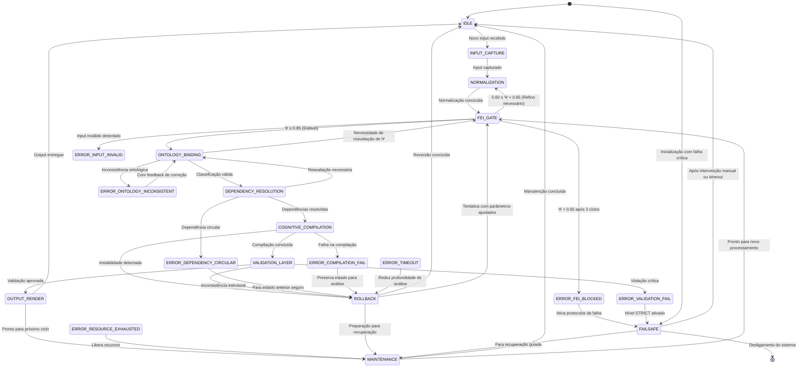

# STATES.md - Máquina de Estados para Sistema de Arquitetura Cognitiva Ontológica V3

## 1. ESTADOS DO SISTEMA

O sistema opera através de estados discretos que representam fases específicas do pipeline de processamento cognitivo. Cada estado possui responsabilidades bem definidas e transições controladas.

### 1.1 Estados Principais

| Estado | Descrição | Responsabilidade |
|--------|-----------|------------------|
| **IDLE** | Estado inicial e de repouso | Aguarda entrada de input, mantém recursos liberados |
| **INPUT_CAPTURE** | Captura de dados brutos | Recebe input bruto, diretivas DSL e contexto explícito |
| **NORMALIZATION** | Sanitização e tokenização | Remove ruído, estrutura tokens, preserva intenção implícita |
| **FEI_GATE** | Filtro de Estabilização de Intenção | Calcula Ψ (Potencial de Resolução), aplica gates de decisão |
| **ONTOLOGY_BINDING** | Vinculação ontológica | Executa classificação N0-N4, vincula diretivas à taxonomia |
| **DEPENDENCY_RESOLUTION** | Resolução de dependências | Resolve hierarquias ontológicas, valida combinações vetor-pilar-domínio |
| **COGNITIVE_COMPILATION** | Compilação cognitiva | Gera instruções operacionais executáveis a partir da classificação |
| **VALIDATION_LAYER** | Camada de validação | Audita coerência estrutural, verifica restrições, detecta inconsistências |
| **OUTPUT_RENDER** | Renderização de saída | Formata e entrega o resultado final processado |
| **FAILSAFE** | Estado de segurança | Trata falhas críticas, inicia protocolos de recuperação ou bloqueio |
| **ROLLBACK** | Estado de reversão | Reverte para estado anterior estável, limpa contexto contaminado |
| **MAINTENANCE** | Estado de manutenção | Executa tarefas de limpeza, atualização de caches, preparação para próximo ciclo |

### 1.2 Estados de Erro

| Estado de Erro | Condição de Gatilho | Ação Corretiva |
|----------------|---------------------|----------------|
| **ERROR_INPUT_INVALID** | Input malformado ou vazão após normalização | Solicita reformulação do input |
| **ERROR_FEI_BLOCKED** | Ψ < 0.60 após 3 ciclos de refinamento | Ativa FAILURE_PROTOCOLS, bloqueia classificação |
| **ERROR_ONTOLOGY_INCONSISTENT** | Combinação vetor-pilar-domínio inválida | Retorna para ONTOLOGY_BINDING com feedback de correção |
| **ERROR_DEPENDENCY_CIRCULAR** | Dependência ontológica circular detectada | Inicia ROLLBACK para estado anterior seguro |
| **ERROR_COMPILATION_FAIL** | Falha na geração de instruções executáveis | Ativa modo de diagnóstico, preserva estado para análise |
| **ERROR_VALIDATION_FAIL** | Violação crítica de restrições estruturais | Transita para FAILSAFE com nível STRICT |
| **ERROR_TIMEOUT** | Tempo de processamento excedido | Inicia ROLLBACK parcial, reduz profundidade de análise |
| **ERROR_RESOURCE_EXHAUSTED** | Esgotamento de recursos operacionais | Transita para MAINTENANCE, libera recursos não essenciais |

## 2. DIAGRAMA DE TRANSIÇÕES



## 3. EVENTOS E GATILHOS

### 3.1 Eventos de Entrada (Trigger Inputs)

| Evento | Descrição | Estado de Origem | Estado de Destino |
|--------|-----------|------------------|-------------------|
| `INPUT_RECEIVED` | Novo input bruto detectado | IDLE | INPUT_CAPTURE |
| `NORMALIZATION_COMPLETE` | Tokenização e sanitização concluídas | INPUT_CAPTURE | NORMALIZATION |
| `FEI_STABLE` | Ψ ≥ 0.85 calculado | NORMALIZATION | FEI_GATE |
| `FEI_PARTIAL` | 0.60 ≤ Ψ < 0.85 após refinamento | NORMALIZATION | FEI_GATE |
| `FEI_BLOCKED` | Ψ < 0.60 após 3 ciclos | NORMALIZATION | FEI_GATE |
| `ONTOLOGY_VALID` | Classificação N0-N4 consistente | FEI_GATE | ONTOLOGY_BINDING |
| `ONTOLOGY_INVALID` | Inconsistência ontológica detectada | FEI_GATE | ONTOLOGY_BINDING |
| `DEPENDENCIES_RESOLVED` | Hierarquia ontológica validada | ONTOLOGY_BINDING | DEPENDENCY_RESOLUTION |
| `DEPENDENCY_CONFLICT` | Conflito de dependências detectado | ONTOLOGY_BINDING | DEPENDENCY_RESOLUTION |
| `COMPILATION_SUCCESS` | Instruções geradas com sucesso | DEPENDENCY_RESOLUTION | COGNITIVE_COMPILATION |
| `COMPILATION_FAILURE` | Falha na geração de instruções | DEPENDENCY_RESOLUTION | COGNITIVE_COMPILATION |
| `VALIDATION_PASSED` | Coerência estrutural verificada | COGNITIVE_COMPILATION | VALIDATION_LAYER |
| `VALIDATION_FAILED` | Violação de restrições crítica | COGNITIVE_COMPILATION | VALIDATION_LAYER |
| `OUTPUT_READY` | Resultado formatado e pronto | VALIDATION_LAYER | OUTPUT_RENDER |
| `PROCESSING_COMPLETE` | Ciclo concluído com sucesso | OUTPUT_RENDER | IDLE |
| `MAINTENANCE_REQUIRED` | Recursos necessitam limpeza | OUTPUT_RENDER | MAINTENANCE |
| `ROLLBACK_TRIGGERED` | Instabilidade detectada | Qualquer estado ativo | ROLLBACK |
| `FAILSAFE_ACTIVATED` | Falha crítica irrecuperável | Qual estado de erro | FAILSAFE |
| `RETRY_REQUESTED` | Nova tentativa solicitada | FAILSAFE/ROLLBACK | FEI_GATE |

### 3.2 Gatilhos Internos (Internal Triggers)

| Gatilho | Condição | Ação |
|---------|----------|------|
| `MAX_REFINEMENTS_REACHED` | 3 ciclos de refinamento concluídos sem Ψ ≥ 0.85 | Transita para ERROR_FEI_BLOCKED |
| `RESOURCE_THRESHOLD_EXCEEDED` | Uso de memória > 90% ou CPU > 85% por >5s | Transita para ERROR_RESOURCE_EXHAUSTED |
| `TIMEOUT_EXCEEDED` | Tempo de processamento > limite configurado | Transita para ERROR_TIMEOUT |
| `INCONSISTENCY_DETECTED` | Conflito entre camadas de validação | Transita para ERROR_VALIDATION_FAIL |
| `CIRCULAR_DEPENDENCY` | Detecção de dependência ontológica circular | Transita para ERROR_DEPENDENCY_CIRCULAR |
| `INVALID_INPUT_PATTERN` | Padrão de input corresponde a conhecido malicioso | Transita para ERROR_INPUT_INVALID |
| `STACK_OVERFLOW_RISK` | Profundidade de recursão > limite seguro | Transita para ROLLBACK imediato |

## 4. ESTADOS DE ERRO E TRATAMENTO

### 4.1 Hierarquia de Gravidade dos Erros

1. **Crítico** (Necessita intervenção manual)
   - ERROR_FEI_BLOCKED após intervenção automática
   - ERROR_RESOURCE_EXHAUSTED com falha de recuperação
   - Falha persistente em FAILSAFE

2. **Alto** (Recuperação automática possível)
   - ERROR_DEPENDENCY_CIRCULAR
   - ERROR_VALIDATION_FAIL com múltiplas tentativas
   - ERROR_TIMEOUT em modo DEEP

3. **Médio** (Recuperação com ajustes)
   - ERROR_ONTOLOGY_INCONSISTENT
   - ERROR_COMPILATION_FAIL
   - ERROR_TIMEOUT em modo QUICK/BALANCED

4. **Baixo** (Recuperação automática)
   - ERROR_INPUT_INVALID (solicita reformulação)
   - FEI_PARTIAL (inicia refinamento orientado)

### 4.2 Protocolos de Tratamento

#### Protocolo de Refinamento Orientado
Quando em estado FEI_PARTIAL:
1. Identificar variável dominante não resolvida
2. Gerar perguntas direcionadas para redução de entropia
3. Limitar a 3 ciclos consecutivos
4. Após cada ciclo, recalcular Ψ e decidir continuidade

#### Protocolo de Rollback Controlado
Quando acionado ROLLBACK:
1. Preservar estado atual para análise pós-mortem
2. Reverter para último estado estável conhecido (IDLE, NORMALIZATION ou FEI_GATE)
3. Limpar contexto contaminado mantendo aprendizados estruturais
4. Aplicar lições aprendidas como restrições adicionais
5. Retentar com parâmetros ajustados (profundidade reduzida, modo mais conservador)

#### Protocolo de Fail-Safe
Quando em estado FAILSAFE:
1. Nível STRICT: Bloqueia completamente, requer intervenção manual
2. Nível LENIENT: Permite saída com avisos de baixa confiança
3. Nível NONE: Desativa verificações (uso por conta e risco)
4. Gerar relatório detalhado de falha para análise
5. Manter logs de auditoria para rastreabilidade

## 5. MECANISMOS DE ROLLBACK OPERACIONAL

### 5.1 Tipos de Rollback

| Tipo | Descritivo | Escopo | Uso Típico |
|------|------------|--------|------------|
| **ROLLBACK_FULL** | Reverte para IDLE | Estado completo do sistema | Falhas críticas, inconsistência estrutural |
| **ROLLBACK_TO_FEI** | Reverte para FEI_GATE | Estado de estabilização | Falhas de classificação ontológica |
| **ROLLBACK_TO_NORMALIZATION** | Reverte para NORMALIZATION | Estado de input processado | Falhas de pré-processamento |
| **ROLLBACK_PARTIAL** | Reverte mantendo alguns caches | Estado seletivo | Recuperação de recursos, timeouts leves |
| **ROLLBACK_WITH_PRESERVATION** | Reverte preservando aprendizados | Estado + metadados | Melhoria contínua após falha recuperável |

### 5.2 Mecanismo de Implementação

O rollback opera através de:
1. **Checkpoints Automáticos**: Salvamento de estado em pontos críticos
2. **Journaling de Operações**: Registro de todas as transições e modificações
3. **Cache Seletivo**: Preservação de elementos não contaminados
4. **Validação Pré-Rollback**: Verificação de integridade do estado de destino
5. **Notificação de Rollback**: Emissão de evento para módulos interessados

### 5.3 Gatilhos de Rollback Automático

- Detecção de dependência circular ontológica
- Falha na validação estrutural após 2 tentativas
- Timeout de processamento em modo DEEP
- Esgotamento de recursos não recuperável em ciclo
- Inconsistência entre camadas de validação e compilação
- Violação de restrições de fail-safe em modo STRICT

## 6. EXEMPLOS DE FLUXOS DE ESTADO

### 6.1 Fluxo Normal de Processamento (Modo BALANCED)

```
IDLE
→ INPUT_CAPTURE (input recebido)
→ NORMALIZATION (tokenização concluída)
→ FEI_GATE (Ψ = 0.75 → parcial)
→ NORMALIZATION (refino orientado)
→ FEI_GATE (Ψ = 0.88 → estável)
→ ONTOLOGY_BINDING (classificação válida)
→ DEPENDENCY_RESOLUTION (dependências resolvidas)
→ COGNITIVE_COMPILATION (instruções geradas)
→ VALIDATION_LAYER (validação aprovada)
→ OUTPUT_RENDER (resultado formatado)
→ IDLE (output entregue, sistema pronto)
```

### 6.2 Fluxo com Refinamento Orientado (Ambiguidade Moderada)

```
IDLE
→ INPUT_CAPTURE
→ NORMALIZATION
→ FEI_GATE (Ψ = 0.65 → parcial)
→ NORMALIZATION (primeiro refinamento)
→ FEI_GATE (Ψ = 0.72 → parcial)
→ NORMALIZATION (segundo refinamento)
→ FEI_GATE (Ψ = 0.81 → parcial)
→ NORMALIZATION (terceiro refinamento)
→ FEI_GATE (Ψ = 0.87 → estável)
→ ONTOLOGY_BINDING
→ ... (continua como fluxo normal)
```

### 6.3 Fluxo com Bloqueio do FEI (Ambiguidade Crítica)

```
IDLE
→ INPUT_CAPTURE
→ NORMALIZATION
→ FEI_GATE (Ψ = 0.58 → parcial)
→ NORMALIZATION (primeiro refinamento)
→ FEI_GATE (Ψ = 0.52 → parcial)
→ NORMALIZATION (segundo refinamento)
→ FEI_GATE (Ψ = 0.49 → parcial)
→ NORMALIZATION (terceiro refinamento)
→ FEI_GATE (Ψ = 0.45 → bloqueado)
→ ERROR_FEI_BLOCKED
→ FAILSAFE (modo STRICT ativado)
→ [Aguardando intervenção manual ou reformulação integral]
```

### 6.4 Fluxo com Rollback por Dependência Circular

```
IDLE
→ INPUT_CAPTURE
→ NORMALIZATION
→ FEI_GATE (Ψ = 0.90 → estável)
→ ONTOLOGY_BINDING (classificação iniciada)
→ DEPENDENCY_RESOLUTION (dependência circular detectada)
→ ERROR_DEPENDENCY_CIRCULAR
→ ROLLBACK (para FEI_GATE com aprendizado preservado)
→ FEI_GATE (reavaliação com restrição adicional)
→ ONTOLOGY_BINDING (classificação reavaliada)
→ DEPENDENCY_RESOLUTION (dependências válidas)
→ ... (continua normalmente)
```

### 6.5 Fluxo com Falha de Compilação e Recuperação

```
IDEL
→ INPUT_CAPTURE
→ NORMALIZATION
→ FEI_GATE (Ψ = 0.92 → estável)
→ ONTOLOGY_BINDING (classificação válida)
→ DEPENDENCY_RESOLUTION (dependências resolvidas)
→ COGNITIVE_COMPILATION (tentativa de compilação)
→ ERROR_COMPILATION_FAIL
→ ROLLBACK (preservando estado para análise)
→ COGNITIVE_COMPILATION (segunda tentativa com abordagem alternativa)
→ VALIDATION_LAYER (validação aprovada)
→ OUTPUT_RENDER
→ IDLE
```

### 6.6 Fluxo de Manutenção Preventiva

```
IDLE
→ OUTPUT_RENDER (ciclo anterior concluído)
→ MAINTENANCE (limpeza de caches, atualização de métricas)
→ IDLE (sistema otimizado para próximo ciclo)
```

## 7. CONFIGURAÇÃO DE ESTADOS VIA DSL

O comportamento da máquina de estados pode ser ajustado através de diretivas DSL:

```
@ESTADO_MAX_REFINEMENTS=3          # Número máximo de ciclos de refinamento
@ESTADO_TIMEOUT_SECONDS=30         # Limite de tempo para processamento
@ESTADO_ROLLBACK_ENABLED=true      # Ativa/desativa mecanismos de rollback
@ESTADO_FAILSAFE_MODE=STRICT       # Modo de fail-safe padrão
@ESTADO_MAINTENANCE_INTERVAL=100   # Executar manutenção a cada N ciclos
@ESTADO_CHECKPOINT_ENABLED=true    # Ativa checkpointing automático
```

## 8. MÉTRICAS DE ESTADO

O sistema coleta métricas para cada estado:

| Métrica | Descrição | Uso |
|---------|-----------|-----|
| `state_entry_count` | Número de entradas em cada estado | Detecção de gargalos |
| `state_duration_ms` | Tempo médio gasto em cada estado | Otimização de performance |
| `state_transition_count` | Número de transições entre estados | Análise de fluxo |
| `state_error_rate` | Taxa de erros por estado | Identificação de pontos fracos |
| `rollback_frequency` | Frequência de rollbacks por tipo | Ajuste de limites de tolerância |
| `refinement_cycles_avg` | Médio de ciclos de refinamento necessários | Calibração de gates FEI |

## 9. CONSIDERAÇÕES DE IMPLEMENTAÇÃO

### 9.1 Garantias de Segurança
- Nenhuma transição ocorre sem validação prévia
- Estados de erro são sempre alcançáveis a partir de qualquer estado ativo
- Rollback preserva integridade do estado de destino
- Fail-safe impede propagação de estados inconsistentes

### 9.2 Requisitos de Performance
- Transições de estado devem ser assíncronas quando possível
- Checkpoints devem ser incrementais para minimizar overhead
- Journaling deve ser assíncrono e não bloqueante
- Busca de estado deve ser O(1) através de mapa de estados

### 9.3 Extensibilidade
- Novos estados podem ser adicionados sem modificar fluxo existente
- Gatilhos personalizados podem ser registrados em tempo de execução
- Protocolos de tratamento de erro podem ser sobrescritos por módulos
- Métricas de estado são expostas através de interface padrão

---
*Este documento define a máquina de estados operacional do Sistema de Arquitetura Cognitiva Ontológica V3, alinhado com as camadas definidas em arquitetura_cognitiva_ontologica_v_3_sistema_operacional_completo.md e o pipeline formal de execução definido em RUNTIME.md.*